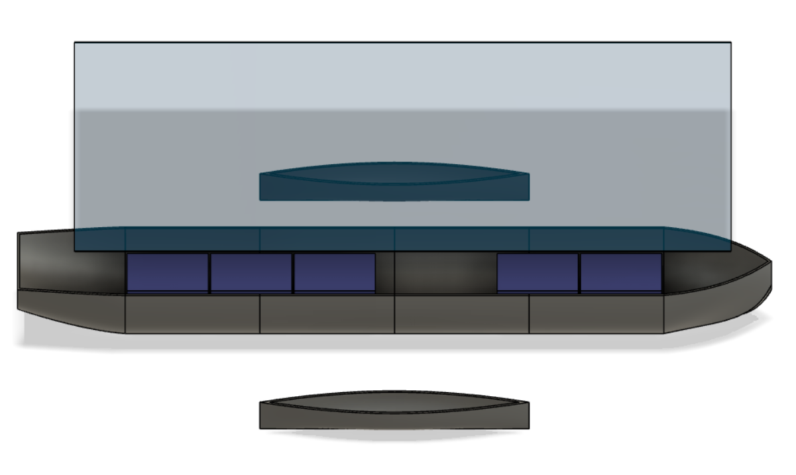
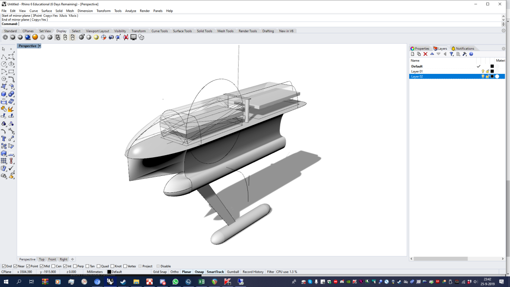
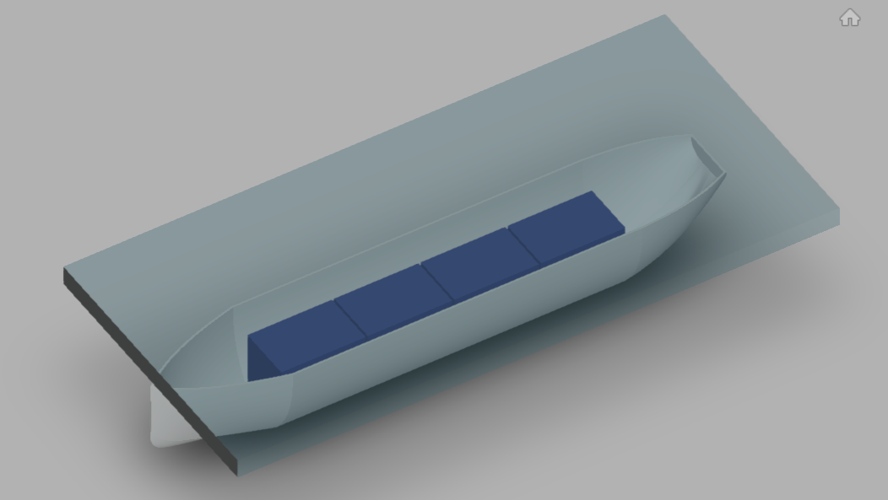

# Media Library
This repository is a library of media related to OSAB. It includes images of CAD models, parts, and vessels as well as images of processes like the building and assembly of vessels. These images are freely available for public viewing and use under the `CC-BY-NC-SA-4.0` license.

## Legal Notice:
All content and media is copyright © Michael MacDonald, released under `CC-BY-NC-SA-4.0`, which gives you permission to use content for almost any non-commercial purpose under some terms. You can learn more [here](https://creativecommons.org/licenses/by-nc-sa/4.0/). A copy of the license can be found in `LICENSE.txt`

# Image Showcase

 

